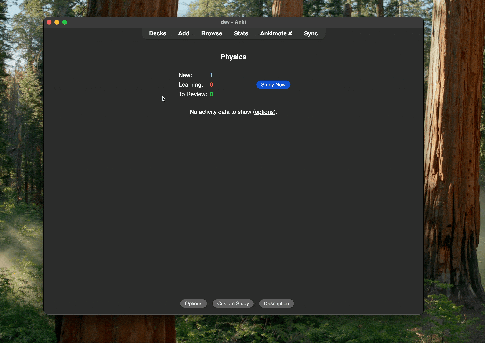
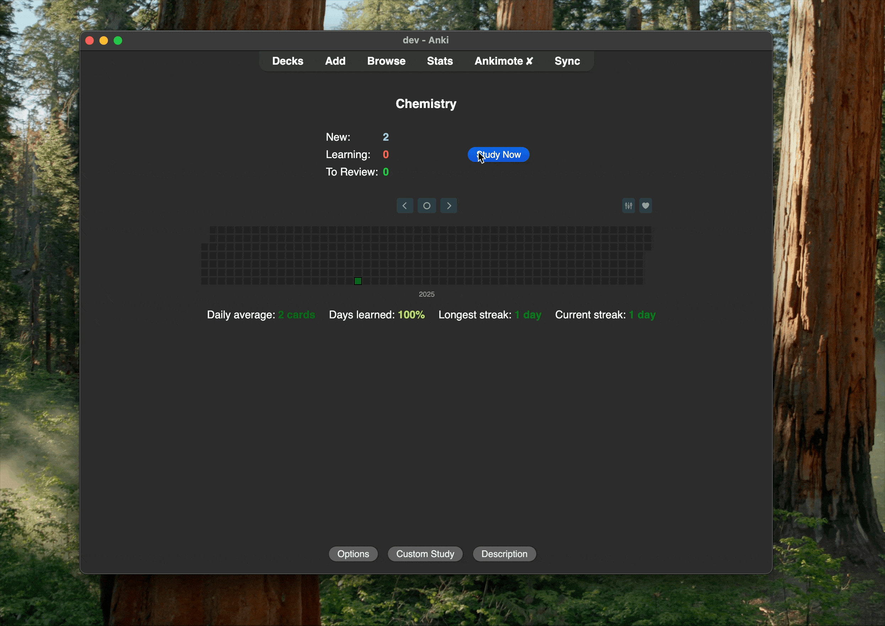
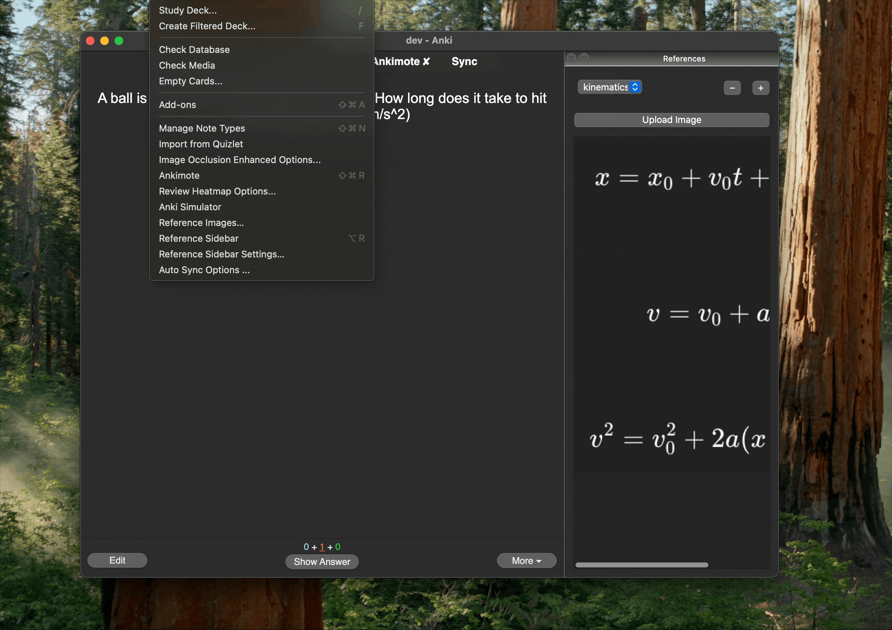

# Reference Image Sidebar

Keep diagrams, cheat-sheets, or pathway charts **always at hand** while you study each deck.
This add-on lets you upload one or more images per deck and view them in a zoomable sidebar during reviews

---

## Features

* **Sidebar toggle** &nbsp;`Alt + R`  
* **Per-deck storage** – images only appear with their linked deck  
* **Upload button** – copies files into Anki’s media folder automatically  
    
* **Image switcher** – dropdown to cycle through multiple references  
* **Zoom** – `Ctrl/⌘` + wheel, pinch gesture, or ± buttons  
    
* **Manage dialog** – Tools → Reference Images… to delete or re-assign  
    
* **Preferences** – Tools → Reference Sidebar Settings… (default zoom, auto-show, width)

---

## Installation

1. Download the latest **`.ankiaddon`** file from the [Releases](…) page *or* AnkiWeb.  
2. In Anki, choose **File → Import** and select the file.  
3. Restart Anki.

Anki 23 or newer (Qt 6 build) is recommended.  Limited Qt 5 compatibility is included, but not extensively tested.

---

## Quick Start

1. Open a deck and start **Reviewing**.  
2. Press **Alt + R** to open the sidebar.  
3. Click **Upload Image**, choose a PNG/JPG/GIF.  
4. The image appears instantly and will auto-show whenever you review that deck.

---

## Shortcuts

| Action           | Shortcut                           |
|------------------|------------------------------------|
| Toggle sidebar   | **Alt + R**                        |
| Zoom in          | **Ctrl/⌘ + wheel-up** or **+**     |
| Zoom out         | **Ctrl/⌘ + wheel-down** or **–**   |

---

## Preferences

* **Auto-show sidebar** when a review starts  
* **Default zoom** level (0.25× – 4×)  
* **Sidebar width**  
* **Remember visibility** across sessions  

Find these under **Tools → Reference Sidebar Settings…**.

---

## Troubleshooting

* If the sidebar doesn’t show images, ensure the files are present in **Tools → Check Media…**.  
* Pinch-to-zoom requires a precision trackpad that emits *native zoom gestures* (macOS).  
* For bug reports or feature requests, please open an Issue on GitHub or use the AnkiWeb comments section.

---

## License

